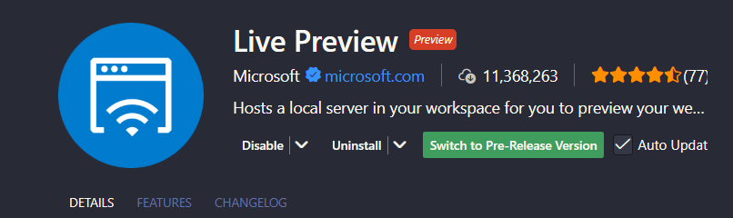

# 🧮 Calculator

Calculator with modern interface with **React.js** and **Tailwind CSS**

## 🚀 Links
* [Figma Design](https://www.figma.com/community/file/1502290022613146600)
## 🛠️ Tech Stack
- [React](https://react.dev/) - React framework for production
- [Javascript](https://developer.mozilla.org/pt-BR/docs/Web/JavaScript) - Programming Language
- [Tailwind CSS](https://tailwindcss.com/) - Utility-first CSS framework
- [Tailwind CSS IntelliSense](https://marketplace.visualstudio.com/items?itemName=bradlc.vscode-tailwindcss) + [Live Preview](https://marketplace.visualstudio.com/items?itemName=ms-vscode.live-server&ssr=false#overview) - Code formatting and host local server

## 📦 Installation
1. Clone the repository 
``` bash
git clone 
``` 
2. Install the Live Preview extension in your IDE

3. Click in calculator press F1 and type live preview, select Live Preview Start Server


## 📝 Notes

### Hooks
- Hooks can only be created as functions; if you create them as classes, it will not work.
- React has its own built-in hooks, the main ones being: useState, useEffect, useContext, etc.
- By convention, hooks should always start with the prefix "use".
- Hooks must be called at the top level of a component.
- Hooks cannot be called inside loops, conditions, or nested functions.